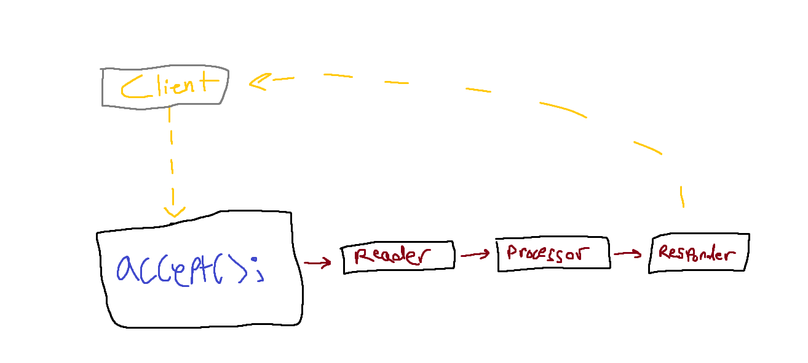

# Tokio Actor Pipeline

## Usage

In order to see this project in action you need to run both the server and client.
The server can handle many connections from clients concurrently.

### Using the server

```sh
$ cargo run --bin server
```

### Using the client

Use `cargo run --bin client` to execute the binary; `ping` and `pong` are the only valid commands.

```sh

See the help information for the client:

```sh
$ cargo run --bin client
CLI to send requests to the server

Usage: client <COMMAND>

Commands:
  ping  Sends a ping to the server
  pong  Sends a pong to the server                               
  help  Print this message or the help of the given subcommand(s)

Options:
  -h, --help  Print help information
```

### Architecture

The server is implemented as a system of actors built with `tokio`.

There is an [accept loop](server/src/accept.rs) which listens for new connections &
starts to process them with the actors.

The server is composed of three actors:

1. [Reader](server/src/actors/reader.rs)
    - Purpose: Network I/O
    - Read request from the client
2. [Processor](server/src/actors/processor.rs)
    - Purpose: Compute
    - Process the request
3. [Responder](server/src/actors/responder.rs)
    - Purpose: Network I/O
    - Respond to the client with the response

